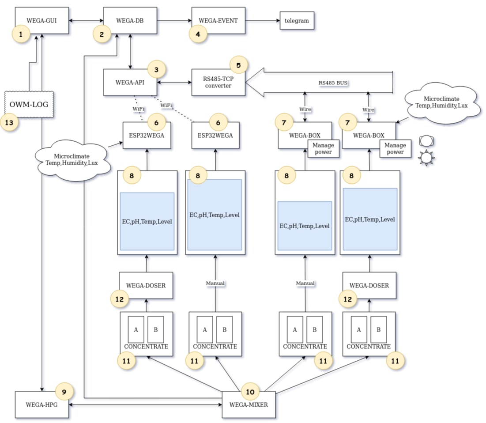

<div align="center">
  <a href="https://raw.githubusercontent.com/WEGA-project/WEGA/master/wega.png"></a>
</div>


Проект `WEGA (Web E-Garden Automation)` - это экосистема объединяющая программно/аппаратные средства, цель которой, контролировать и помогать выращивать растения на гидропонике. 

Основная идея проекта - разработка простых, самостоятельных элементов облегчающих выращивание растений, при этом умеющих работать вместе в едином информационном взаимодействии.

Ниже можно видеть всю экосистему, где блоки 1-4 и 13, это части `WEGA`

<div align="center">
  <a href="images/wega-ecosystem.jpeg"></a>
</div>


---
# Что такое WEGA server и как его настроить

Больше информации о том, что же такое `WEGA` можно почитать на [Wiki](https://github.com/WEGA-project/WEGA/wiki)

### Установка через скрипт
Установка сервера и минимальное конфигурирование через скрипт

Скрипт проверн на `ubuntu server 20.04` OS, которые были установлены на `VirtualBox` и `AWS`. 🥳

Т.е. можно использовать как локально, так и в cloud(клауде).

⚠️ **ВАЖНО: Если решили поднимать сервер на AWS, помните про security groups(доступ к серверу необходимо разрешить для вашего IP адреса на 80 порт)** ⚠️

* Установить `ubuntu server 20.04` на виртуальную машину или любой клауд (AWS, GCP , Azure, Oracle)
* Подключиться по `ssh` к серверу
* Скопировать и выполнить на сервере следущее
``` 
sudo su
curl -s https://raw.githubusercontent.com/WEGA-project/wega/master/install.sh | bash
```
* Пойти выпить чаю или еще чего, пока идет настройка и конфигурирование
* Прочитать информацию после установки, где будет написано, как зайти через веб интерфейс на ваш свеже-установленный `WEGA SERVER`
* Не забыть скопировать и сохранить информацию для веб доступа и `WEGABOX`

### Видео, о том как установить WEGA SERVER

[](https://youtu.be/TOMY-anSX0E "WEGA SERVER + WEGABOX - Установка WEGA SERVER")
### Более детальную и пошаговую инструкцию можно найти по ссылке ниже

Установка и конфигурирование сервера описана так же в [Wiki-install](https://github.com/WEGA-project/WEGA/wiki/install)
